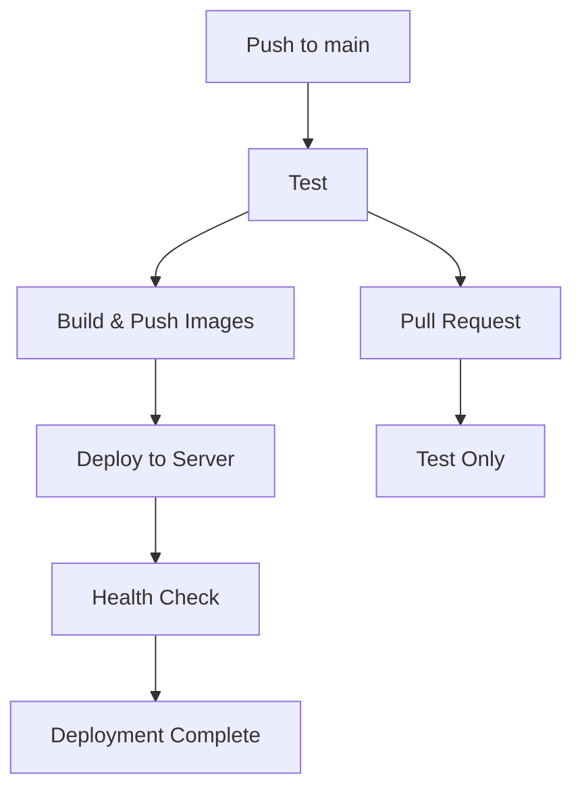

# 🚀 Полный CI/CD Pipeline - Готов к использованию!

## 🎯 Обзор

Система аналитики кредитного портфеля теперь имеет полноценный CI/CD pipeline с автоматическим развертыванием на продакшен сервер.

## 📋 Что настроено

### ✅ GitHub Actions Workflows
- **Тестирование**: Автоматические тесты при Pull Request
- **Сборка**: Docker образы собираются и публикуются в GitHub Container Registry
- **Развертывание**: Автоматическое развертывание на сервер при push в main

### ✅ GitHub Secrets
- `SERVER_HOST`: 87.228.88.77
- `SERVER_USER`: root
- `SERVER_SSH_KEY`: Приватный SSH ключ
- `PROJECT_PATH`: /opt/credit-analytics

### ✅ Docker Registry
- **Backend**: `ghcr.io/pavelstepanovpm/CredAnlv2-backend`
- **Frontend**: `ghcr.io/pavelstepanovpm/CredAnlv2-frontend`

## 🔧 Быстрый старт

### 1. Настройка GitHub Secrets (если еще не сделано)
```bash
# Автоматическая настройка
./scripts/setup-github-secrets.sh

# Или вручную через GitHub UI
# Settings → Secrets and variables → Actions
```

### 2. Тестирование развертывания
```bash
# Полный тест с созданием коммита
./scripts/test-deployment.sh

# Только проверка текущего состояния
./scripts/test-deployment.sh --check-only
```

### 3. Мониторинг развертывания
- **GitHub Actions**: https://github.com/pavelstepanovpm/CredAnlv2/actions
- **Frontend**: http://87.228.88.77:3002
- **Backend**: http://87.228.88.77:8001/docs

## 🏗️ Архитектура CI/CD

### Workflow: Production Deployment


### Этапы развертывания:
1. **Тестирование** (только для PR)
   - Установка Python зависимостей
   - Запуск тестов
   - Проверка качества кода

2. **Сборка и публикация**
   - Сборка Docker образов
   - Публикация в GitHub Container Registry
   - Кэширование для ускорения

3. **Развертывание**
   - SSH подключение к серверу
   - Остановка старых контейнеров
   - Обновление кода
   - Запуск новых контейнеров
   - Проверка работоспособности

## 📊 Мониторинг и управление

### GitHub Actions
- **URL**: https://github.com/pavelstepanovpm/CredAnlv2/actions
- **Статус**: Автоматически обновляется при каждом push
- **Логи**: Детальные логи каждого этапа

### Сервер (87.228.88.77)
```bash
# Подключение
ssh -i ~/.ssh/DSkey_project root@87.228.88.77

# Управление контейнерами
cd /opt/credit-analytics
docker-compose ps
docker-compose logs -f
docker-compose restart
```

### Проверка работоспособности
```bash
# Frontend
curl -f http://87.228.88.77:3002

# Backend
curl -f http://87.228.88.77:8001/docs

# Все сервисы
./scripts/test-deployment.sh --check-only
```

## 🔄 Workflow использования

### Разработка
1. Создайте feature ветку
2. Внесите изменения
3. Создайте Pull Request
4. GitHub Actions автоматически протестирует изменения

### Развертывание
1. Merge Pull Request в main
2. GitHub Actions автоматически:
   - Соберет Docker образы
   - Опубликует их в Registry
   - Развернет на сервер
   - Проверит работоспособность

### Откат (если нужно)
```bash
# На сервере
cd /opt/credit-analytics
git log --oneline -10
git reset --hard <предыдущий_коммит>
docker-compose up -d
```

## 🛠️ Полезные команды

### Локальная разработка
```bash
# Запуск локально
./start_system.py

# Тестирование
python -m pytest tests/

# Проверка качества кода
flake8 .
```

### Управление секретами
```bash
# Просмотр секретов
gh secret list --repo pavelstepanovpm/CredAnlv2

# Удаление секрета
gh secret delete SECRET_NAME --repo pavelstepanovpm/CredAnlv2
```

### Мониторинг сервера
```bash
# Статус контейнеров
ssh -i ~/.ssh/DSkey_project root@87.228.88.77 "cd /opt/credit-analytics && docker-compose ps"

# Логи
ssh -i ~/.ssh/DSkey_project root@87.228.88.77 "cd /opt/credit-analytics && docker-compose logs -f"

# Использование ресурсов
ssh -i ~/.ssh/DSkey_project root@87.228.88.77 "docker stats"
```

## 🎯 Результат

### ✅ Что работает:
- **Автоматическое тестирование** при Pull Request
- **Автоматическая сборка** Docker образов
- **Автоматическое развертывание** на продакшен
- **Проверка работоспособности** после развертывания
- **Мониторинг** через GitHub Actions
- **Откат** при необходимости

### 🌐 Доступные сервисы:
- **Frontend**: http://87.228.88.77:3002
- **Backend API**: http://87.228.88.77:8001/docs
- **GitHub Actions**: https://github.com/pavelstepanovpm/CredAnlv2/actions

### 📈 Преимущества:
- **Быстрое развертывание**: От коммита до продакшена за 5-10 минут
- **Надежность**: Автоматические тесты и проверки
- **Мониторинг**: Полная видимость процесса развертывания
- **Безопасность**: Использование GitHub Secrets
- **Масштабируемость**: Легко добавить новые сервисы

## 🚀 Следующие шаги

### Опциональные улучшения:
1. **SSL сертификаты** (Let's Encrypt)
2. **Домен** вместо IP адреса
3. **Мониторинг** (Prometheus + Grafana)
4. **Логирование** (ELK Stack)
5. **Резервное копирование** базы данных
6. **Load balancer** для высокой доступности

### Расширение функциональности:
1. **Staging окружение** для тестирования
2. **Blue-Green развертывание**
3. **Автоматические тесты** с реальными данными
4. **Performance тесты**

---
**🎉 Поздравляем! Ваш CI/CD pipeline полностью настроен и готов к использованию!**

*Документация создана: 17 октября 2025*  
*Версия: 1.0.0*
